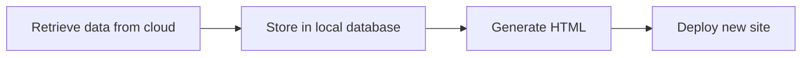

# Home sensor data logger and website

This repository contains some software tools to collect data from a cloud based
resource and create a website to display the data.
The general process is as follows:



This project primarily leverages GitHub resources for as many components
as possible.
The data is retrieved through a job run with GitHub Actions, it is added to
a csv file stored in the repository also through GitHub Actions, and the resulting
HTML is hosted through GitHub Pages.

Currently, this project gets data from small temperature and humidity sensors
placed around my house.
Every hour, they take a measurement and send the data to a Tuya account.
This data is then retrieved through the Tuya API and stored in a local database.
The website presents the temperature and humidity data in plots using Plotly.

## Retrieving the data

A job is configured with GitHub Actions to run every hour via a cron job:

```yaml
    schedule:
    - cron:  '00 * * * *'
```

The job is called
[get-data-update-db](https://github.com/rafmudaf/my_house_data/blob/main/.github/workflows/dbupdate.yaml#L12),
and it does the following steps:
1. Clone the repository
2. Install the required Python packages
3. Run the `get_sensor_data.py` script
4. Commit the changes to the csv database file to the repository

The [get_sensor_data.py](https://github.com/rafmudaf/my_house_data/blob/main/get_sensor_data.py) script
contains a data processing pipeline specific to this data.
At a high level, it does the following:
1. Authenticate with the Tuya API resulting in an authentication token for future API requests
2. For each sensor, request the current status containing the last measurement received by Tuya
3. Append sensor data to the local database and assign it to the current timestamp

Note that this means the timestamp assigned to the data point is not the time of the measurement,
it's the time it was retrieved from the Tuya API.

## Store locally

The local database is simply a csv file for all the channels.
The first column is the timestamp for when the data point was added to the database.
GitHub Actions is configured to commit the changes to the repository automatically
with this following configuration:

```yaml
      - name: Save
        working-directory: ${{runner.workspace}}/my_house_data/
        run: |
          git config user.name github-actions
          git config user.email github-actions@github.com
          git add sensor_data.csv
          git commit -m "Update DB" --allow-empty
          git push
```

## Generate HTML

The static HTML file is updated with a GitHub Action job called
[generate_plot](https://github.com/rafmudaf/my_house_data/blob/main/.github/workflows/dbupdate.yaml#L51)
that runs the [plot_plotly.py](https://github.com/rafmudaf/my_house_data/blob/main/plot_plotly.py)
script.
This reads the local database, creates a plot using the Plotly library,
and saves it to a HTML file.
Again, GitHub Actions directly commits the new HTML file to the repository using
a similar configuration as described above.

## Deploy new site

Finally, the GitHub Pages site is configured to host from the `docs/` folder,
so GitHub expects to find a `index.html` file there.
The HTML file generated by the previous step becomes the
[docs/index.html](https://github.com/rafmudaf/my_house_data/blob/main/docs/index.html) file,
so committing it to the repository triggers GitHub to update the site automatically.
